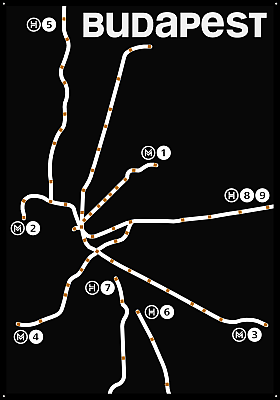

# BudapestMetroDisplay

LED Display for the Budapest Metro and Suburban railway network.

If you are looking for the easiest way to **start using your display
under Home Assistant:** ***[Home Assistant Quick Start Guide](HomeAssistant.md)***

## Hardware

The hardware of this project is a 210 mm x 300 mm sized bare PCB,
designed to fit into a picture frame, especially the IKEA LOMVIKEN.

The display shows a map of the subway and suburban railway network of
Budapest. At every stop there is an RGB LED, which can show whether a vehicle
is currently at that stop.

More information about the hardware (PCB size, WiFi controller, LEDs, etc.),
can be found in the **[hardware](hardware/README.md)** folder.

### ESPHome

The display uses an ESP32-S3 controller and ESPHome as it's firmware.

More information about the ESPHome firmware can be found in the
**[esphome](esphome/README.md)** folder.

## Software

The control software is written in python.

It gets the schedule, realtime and alert data from the
[BKK OpenData](https://opendata.bkk.hu/home) portal.
You need to obtain an API key for yourself to use the software.

The software processes the data from the API and controls the LEDs
via sACN (E1.31) protocol.

More information about the software (installation, configuration options,
etc.), can be found in the **[software](software/README.md)** folder.
